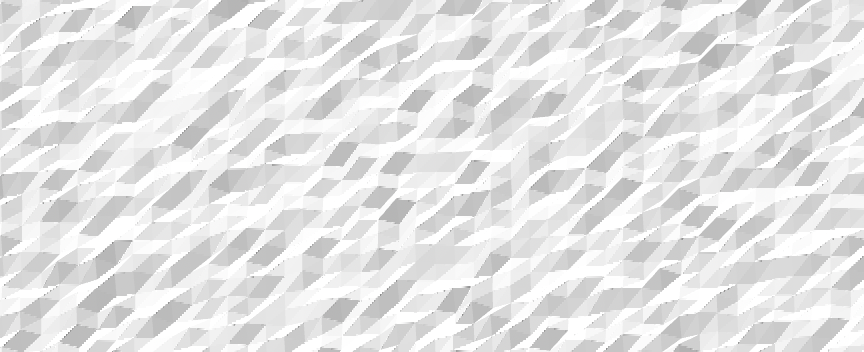

# Student Conference 2024 Material

3D model and code to reproduce one of the experiments to compare two algorithms for NVIDIA's Micro Meshes.

## Usage

You can find the ready-to-use 3D model [here](noise.obj). If you want to create your own, have a look at [gen_model.py](gen_model.py).

Make sure that all requirements are installed. For example:

```bash
pyhton3 -m pip install -r requirements.txt
python3 gen_model.py
```


